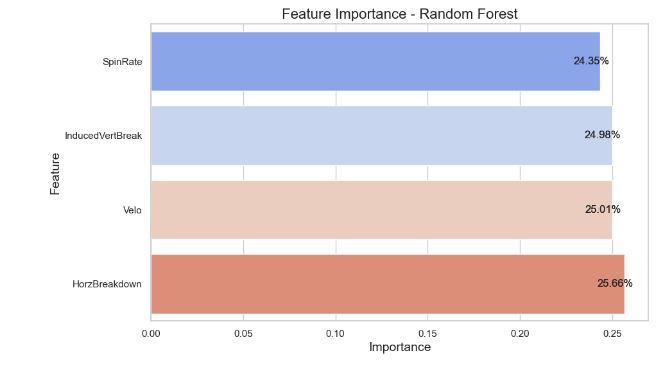

# Research Analyst Assignment

# Question 1
The model was completed in [this jupyter notebook file](https://github.com/james-mccarron/BlueJaysResearchAnalystAssignment/blob/main/PredictionModel.ipynb).
The final csv can be found [here](https://github.com/james-mccarron/BlueJaysResearchAnalystAssignment/blob/main/deploy_with_predictions.csv)

# Question 2
In Question 1, I started by pre-processing the data to handle missing values. Due to the very small number of rows with a Null value in them, I decided to remove these rows instead of performing things such as imputation. I then normalized the feature variables 'Velo', 'SpinRate', 'HorzBreak', and 'InducedVertBreak'. The data was then split into training and testing sets. I employed four different machine learning algorithms for model training: Logistic Regression, Random Forest, Support Vector Machine (SVM), and Gradient Boosting. I also incorporated class-weight balancing in Logistic Regression to account for the imbalanced dataset. To objectively evaluate model performance, I used a classification report that included metrics like precision, recall, and f1-score for each class label. The Random Forest model was found to be the most accurate, at 72.2%. Finally, I performed 5-fold cross-validation on the Random Forest model to validate its effectiveness. The models were also deployed on a separate dataset ('deploy.csv') for future predictions, ensuring the models' scalability and adaptability to new data.

# Question 3
The four variables all have an relatively equal impact on the batter's ability to put the ball in play, with SpinRate at 24.35%, InducedVertBreak at 24.98%, Velo at 25.01%, and HorzBreakdown at 25.66% . The balance in feature importance suggests that a combination of these factors rather than a single one is crucial for influencing the in-play outcomes.

# Question 4
I would work on collecting more data and fine-tuning the model to allow for a more accurate prediction. The results of the models indicate that there could be noisy data and many other aspects affecting the InPlay results.
